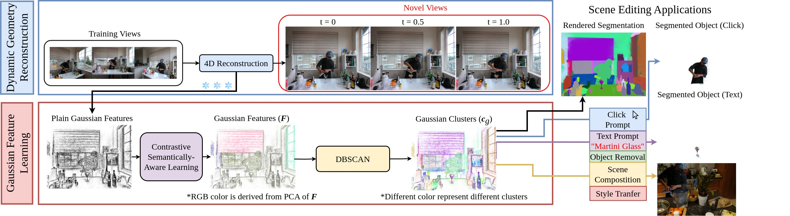

# SADG: Segment Any Dynamic Gaussians Without Object Trackers

## [Project page](https://yunjinli.github.io/project-sadg/) | [Paper]()

## News

- 2024/11/24: We released the [website](https://yunjinli.github.io/project-sadg/) for SADG
- 2024/11/23: We plan to release the rest of the source code and also the Mask-Benchmarks later.

## Introduction

We introduce SADG, Segment Any Dynamic Gaussian Without Object Trackers, a novel approach that combines dynamic Gaussian Splatting representation and semantic information without reliance on object IDs. We propose to learn semantically-aware features by leveraging masks generated from the Segment Anything Model (SAM) and utilizing our novel contrastive learning objective based on hard pixel mining. The learned Gaussian features can be effectively clustered without further post-processing. This enables fast computation for further object-level editing, such as object removal, composition, and style transfer by manipulating the Gaussians in the scene. Due to the lack of consistent evaluation protocol, we extend several dynamic novel-view datasets with segmentation benchmarks that allow testing of learned feature fields from unseen viewpoints. We evaluate SADG on proposed benchmarks and demonstrate the superior performance of our approach in segmenting objects within dynamic scenes along with its effectiveness for further downstream editing tasks.



<!--  -->

<!--  -->

## Installation

```
git clone https://github.com/yunjinli/SADG-SegmentAnyDynamicGaussian.git
cd SADG
conda create -n SADG python=3.8 -y
pip install "git+https://github.com/facebookresearch/pytorch3d.git@stable"
pip install torch==1.13.1+cu117 torchvision==0.14.1+cu117 torchaudio==0.13.1 --extra-index-url https://download.pytorch.org/whl/cu117
pip install opencv-python plyfile tqdm scipy wandb opencv-python scikit-learn lpips imageio[ffmpeg] dearpygui kmeans_pytorch hdbscan scikit-image bitarray
python -m pip install submodules/diff-gaussian-rasterization
python -m pip install submodules/simple-knn
cd dependency
## Install SAM weights
bash install.bash
git clone https://github.com/hkchengrex/Grounded-Segment-Anything.git
cd Grounded-Segment-Anything
export AM_I_DOCKER=False
export BUILD_WITH_CUDA=True
python -m pip install -e segment_anything
python -m pip install -e GroundingDINO

```

## Download and Process the Dataset

### NeRF-DS

```
cd data/NeRF-DS
bash download_dataset.bash
```

For generating the anything-masks from SAM.

```
python extract_masks.py --img_path data/NeRF-DS/<NAME>/rgb/2x --output data/NeRF-DS/<NAME> --iou_th 0.88 --stability_score_th 0.95 --downsample_mask 2
```

### HyperNeRF

```
cd data/HyperNeRF
bash download_dataset.bash
```

For generating the anything-masks from SAM.

```
python extract_masks.py --img_path data/HyperNeRF/<interp/misc>/<NAME>/rgb/2x --output data/NeRF-DS/<NAME> --iou_th 0.88 --stability_score_th 0.95 --downsample_mask 2
```

### Neu3D

```
cd data/Neu3D
bash download_dataset.bash
```

For generating initial point cloud. Make sure you have COLMAP installed. We use COLMAP 3.9.1.

```
python n3v2blender.py --path data/Neu3D/<NAME> --scale 2
```

For generating the anything-masks from SAM.

```
python extract_masks.py --img_path data/Neu3D/<NAME>/images_2x --output data/Neu3D/<NAME> --iou_th 0.88 --stability_score_th 0.95 --downsample_mask 4 --neu3d
```

### Google Immersive

Download the dataset from [here](https://github.com/augmentedperception/deepview_video_dataset). Note that we only use 01_Welder, 02_Flames, 10_Alexa_Meade_Face_Paint_1, and 11_Alexa_Meade_Face_Paint_2.

For generating initial point cloud. Make sure you have COLMAP installed. We use COLMAP 3.9.1.

```
python immersive2blender.py --path data/immersive/<NAME> --scale 2
```

For generating the anything-masks from SAM.

```
python extract_masks.py --img_path data/immersive/<NAME>/images_2x --output data/immersive/<NAME> --iou_th 0.88 --stability_score_th 0.95 --downsample_mask 4 --neu3d
```

### Technicolor Light Field

Please contact the author from "Dataset and Pipeline for Multi-View Light-Field Video" for access. We use the undistorted data from Birthday, Fabien, Train, and Theater.

For generating initial point cloud. Make sure you have COLMAP installed. We use COLMAP 3.9.1.

```
python technocolor2blender.py --path data/technicolor/Undistorted/<NAME> --scale 2
```

For generating the anything-masks from SAM.

```
python extract_masks.py --img_path data/technicolor/Undistorted/<NAME>/images_2x --output data/technicolor/Undistorted/<NAME> --iou_th 0.88 --stability_score_th 0.95 --downsample_mask 2 --neu3d
```

## Train

### NeRF-DS

```
python train.py -s data/NeRF-DS/<NAME> -m output/NeRF-DS/<NAME> --warm_up 3000 --warm_up_3d_features 15000 --iterative_opt_interval 20000 --iterations 30000 --test_iterations 10000 15000 20000 30000 --save_iterations 20000 30000 --monitor_mem --densify_until_iter 15000 --lambda_reg_deform 0.0 --eval --load2gpu_on_the_fly --num_sampled_pixels 5000 --reg3d_interval -1 --num_sampled_masks 25 --smooth_K 16

```

### HyperNeRF

```
python train.py -s data/HyperNeRF/<interp/misc>/<NAME> -m output/HyperNeRF/<NAME> --warm_up 1500 --warm_up_3d_features 15000 --iterative_opt_interval 20000 --iterations 30000 --test_iterations 10000 15000 20000 30000 --save_iterations 20000 30000 --monitor_mem --densify_until_iter 9000 --lambda_reg_deform 0.0 --eval --load2gpu_on_the_fly --num_sampled_pixels 5000 --reg3d_interval -1 --num_sampled_masks 25 --smooth_K 16
```

### Neu3D

```
python train_multiview.py    -s data/Neu3D/<NAME> -m output/Neu3D/<NAME> --warm_up 3000 --warm_up_3d_features 15000 --iterative_opt_interval 20000 --iterations 30000 --test_iterations 10000 15000 20000 30000 --save_iterations 10000 15000 20000 30000 --monitor_mem --densify_until_iter 8000 --lambda_reg_deform 0 --eval --load2gpu_on_the_fly --num_sampled_pixels 10000 --reg3d_interval -1 --num_sampled_masks 50 --smooth_K 16 --load_mask_on_the_fly --load_image_on_the_fly ## For multiview dataset, it's supported to load images and anything-masks on-the-fly to reduce RAM usage
```

### Immerseve

```
python train_multiview.py    -s data/immersive/<NAME> -m output/immersive/<NAME> --warm_up 1500 --warm_up_3d_features 15000 --iterative_opt_interval 20000 --iterations 30000 --test_iterations 10000 15000 20000 30000 --save_iterations 10000 15000 20000 30000 --monitor_mem --densify_until_iter 3000 --lambda_reg_deform 0 --eval --load2gpu_on_the_fly --num_sampled_pixels 10000 --reg3d_interval -1 --num_sampled_masks 50 --end_frame 50 --load_mask_on_the_fly --load_image_on_the_fly ## For multiview dataset, it's supported to load images and anything-masks on-the-fly to reduce RAM usage
```

### Technicolor

```
python train_multiview.py    -s data/technicolor/Undistorted/<NAME> -m output/technicolor/<NAME> --warm_up 3000 --warm_up_3d_features 15000 --iterative_opt_interval 20000 --iterations 30000 --test_iterations 10000 15000 20000 30000 --save_iterations 10000 15000 20000 30000 --monitor_mem --densify_until_iter 5000 --lambda_reg_deform 0 --eval --load2gpu_on_the_fly --num_sampled_pixels 10000 --reg3d_interval -1 --num_sampled_masks 50 --load_mask_on_the_fly --load_image_on_the_fly ## For multiview dataset, it's supported to load images and anything-masks on-the-fly to reduce RAM usage
```

## GUI

We attach tutorial of our GUI in the supplementary.

```
python gui_sadg.py -m output/<DATASET>/<NAME> --load_mask_on_the_fly --load_image_on_the_fly --eval --load2gpu_on_the_fly --is_testing --end_frame -1 --iteration 30000 ## For immersive --end_frame 50
```

## Render

### Render all

```
python render.py -m output/<DATASET>/<NAME> --load_mask_on_the_fly --load_image_on_the_fly --eval --load2gpu_on_the_fly --is_testing --end_frame -1 --skip_train--iteration 30000 ## For immersive --end_frame 50
```

### Render with text prompt

```
python render.py -m output/<DATASET>/<NAME> --load_mask_on_the_fly --load_image_on_the_fly --eval --load2gpu_on_the_fly --is_testing --end_frame -1 --skip_train--iteration 30000 --text_prompt "TEXT_PROMPT" ## For immersive --end_frame 50
```

### Render with cluster ID

When you click the object in the GUI. You can see which cluster IDs are segemented.

```
python render.py -m output/<DATASET>/<NAME> --load_mask_on_the_fly --load_image_on_the_fly --eval --load2gpu_on_the_fly --is_testing --end_frame -1 --skip_train --iteration 30000 --segment_ids <1> <2> <...> ## For immersive --end_frame 50
```

## Style Transfer

Style Transfer of the selected object (segment_ids).

```
python train_style_transfer_nnfm.py -s data/<DATASET>/<NAME> -m output/<DATASET>/<NAME> --load2gpu_on_the_fly --end_frame -1 --load_mask_on_the_fly --load_image_on_the_fly --load_iteration 30000 --iterations 35000 --eval --monitor_mem --save_iterations 35000 --segment_ids <0> <1> <...> --reference_img_path ./styles/<picture>.png
```

## Evaluation

We plan to release our Mask-Benchmarks upon acceptance.

Run the following command to compute the mIoU and mAcc respected to our benchmarks.

```
python metrics_segmentation.py -m output/<DATASET>/<NAME> --no_psnr
```
